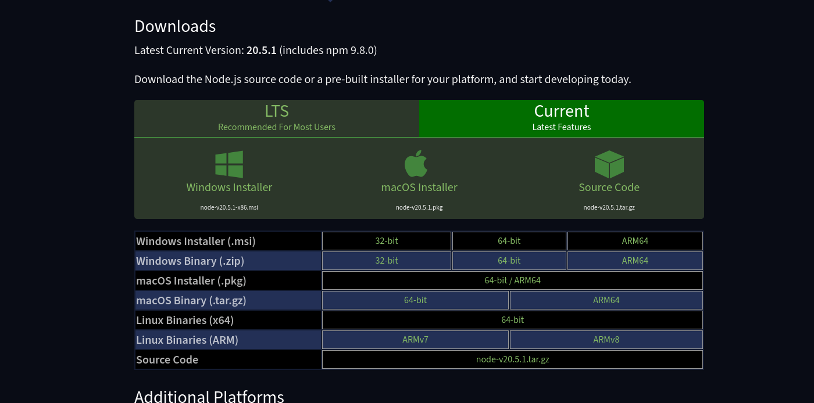
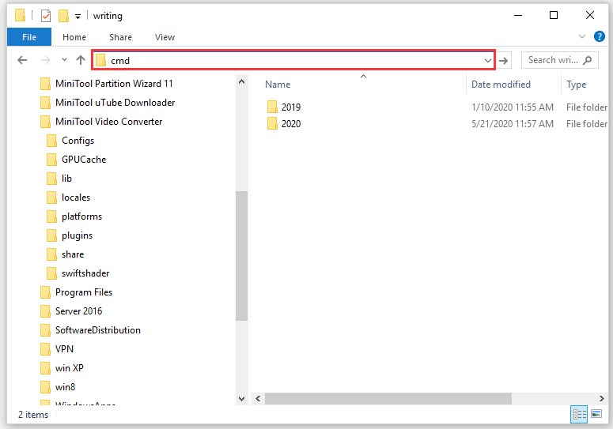

### 1.0.0

- info
- design
- ux

### installing node.js
install node js, the javascript framework that allows us to run code and build the site
[Nodejs](https://nodejs.org/en/download/current)

click teh big windows logo and use the .msi installer. follow its instructions etc etc cant help ya im not on windows :P

press `windows key + R` and type in `cmd` hit `enter`. type in `node --version`. it should print out the version of node js if its installed correctly

### installing the site
download this repository as zip, unzip it and go into the folder and delete everything thats in the location bar and type in `cmd` instead. hit `enter` and the same big window should pop up. but the window knows now were in the com-kcamv folder!

 
then type in `npm i` which will look at the `package.json` and download every **dependency** (= tool or extension that ive used but did not code myself)

after that, you should be set up and ready to go!

### starting the site

remember, all thsoe weird named fiels is not what your webpage will be, we have to **build** them first!

in the same black cmd window, type in `npm run build` to create a folder named **public** -> *thats* your webpage! 

to see what it looks like use the `npm run start` command. after running it the prompt to type in the cmd will not appear anymore - and closing the cmd window will turn the preview of your off! to see it in your browser 

alternatively you can go to the `public` folder and double click the first index.html you see :)

congrats! what you did is called **building from source** and you did it! :D