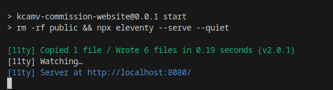

### 1.0.0 requirements
- ~~structure -> version bump~~
- ~~info -> version bump~~
### 2.0.0
- design -> version bump
- ux -> version bump

# LIVE SITE IS AT https://kcamv.neocities.org/

## Building the page from source

---
#### short version:
  - install [Nodejs](https://nodejs.org/en/download/current) 
  - install [git](https://git-scm.com/book/en/v2/Getting-Started-Installing-Git)
  - pull this repo and run `npm i` in project root to update
  - run `npm run build` for a clean build, `npm run start` for server

---

### installing node.js
install node js, the javascript framework that allows us to run code and build the site
[Nodejs](https://nodejs.org/en/download/current)

click teh big windows logo and use the .msi installer. follow its instructions etc etc cant help ya im not on windows :P

press `windows key + R` and type in `cmd` hit `enter`. type in `node --version`. it should print out the version of node js if its installed correctly

### installing the site
download this repository as zip, unzip it and go into the folder and delete everything thats in the location bar and type in `cmd` instead. hit `enter` and the same big window should pop up. but the window knows now were in the com-kcamv folder!

(this is a screenshot from google)

then type in `npm i` which will look at the `package.json` and download every **dependency** (= tool or extension that ive used but did not code myself)

after that, you should be set up and ready to go!

### starting the site

remember, all thsoe weird named fiels is not what your webpage will be, we have to **build** them first!

in the same black cmd window, type in `npm run build` to create a folder named **public** -> *thats* your webpage! 

to see what it looks like use the `npm run start` command. after running it the prompt to type in the cmd will not appear anymore - and closing the cmd window will turn the preview of your off! 

(it should look something like this)

<b>more detailed explanation here of whats happening here</b>

this is the output of the eleventy **dev server** - it creates a live preview of your bult page (the one in `public`!) its cool because you dont have to rerun the build command, it automatically builds and displays the pagewhenever it detects a change on disk, like when you save a file!

1. `> kcamv-commission-website@0.0.1 start` what website is being started @ version number
2. `rm -rf public && npx eleventy --serve --quiet`:
   - remove (`rm`) iself, all sub-olders and files (`-rf`) from the foler `public`
   - and (`&&`)  start eleventy (`npx eleventy`) in the server mode (`--serve`) but dont print too many thing into the consoel (`--quiet`)
3. the [11ty] prefixed lines are the output - what the eleventy server is telling us!
   1.  `Copied 1 file` means it copy pasted 1 file without makign any changes
   2.  `Wrote 6 files` means it had to do some modification in 6 files, usually those ending with .njk or .md `in 0.20 seconds` and that's your version `(v2.0.1)`!
4. `Watching…` is letting you know that when you make a change to, lets say `index.njk`, it will automatically build that file into a good .html and automatically display it in your browser, no reloading necessary #devServer
5. `Server at http://localhost:8080/` - this is self explanatory, you can open this link like any webpage, since it's a locally hosted website! its only on your computer, but it behaves liem any "real" one :P

while the command is running, to see the page just copy the link if it has different numbers than in the screenshots, or go [here](http://localhost:8080/)

alternatively you can go to the `public` folder and double click the first index.html you see :)

congrats! what you did is called **building from source** and you did it! :D

---

todo:
- rework css for header (ew)
- fix nav and anchor it to the hover (i dotn want to)
- UTILIZE THE ELEVENTY IMAGE PLUGIN (i am BEGGING you)
- svgs need to be white/gray/beige (easy :D)
- preview images
- clear font sizes
- page layouts but prettier